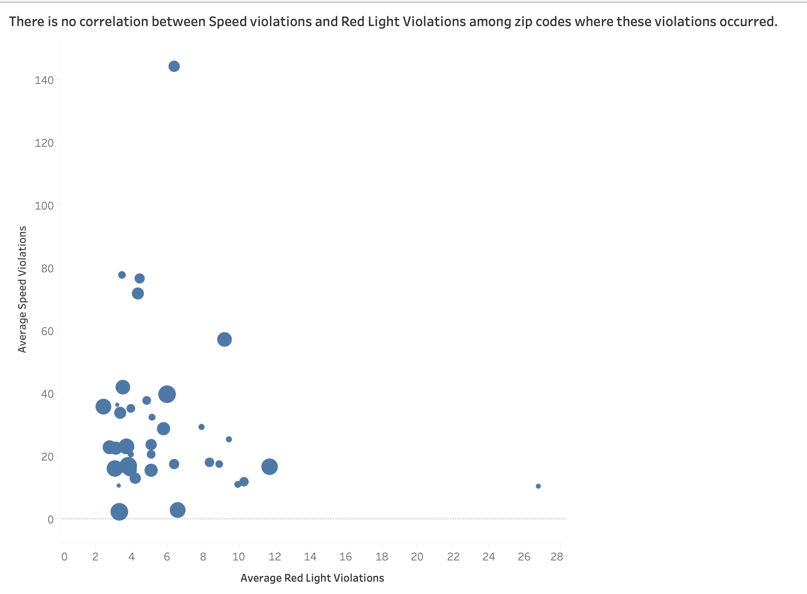

# Speed Camera Violations, City of Chicago 

This file documents the analysis of **_Speed Camera Violations_** dataset provided by the City of Chicago. 
The dataset can be accessed [here](https://data.cityofchicago.org/Transportation/Speed-Camera-Violations/hhkd-xvj4).

## Introduction
Chicago experiences roughly 3,000 crashes annually between motor vehicles and pedestrians, about 800 of which involve children. Hence, the city initiated Children’s Safety Zone Program which protects children and other pedestrians by reminding motorists to slow down and obey speed laws – especially in school and park zones. 
Safety zones are designated as a 1/8th of a mile boundary around any Chicago parks or schools.  
(Reference:https://www.chicago.gov/city/en/depts/cdot/supp_info/children_s_safetyzoneporgramautomaticspeedenforcement.html)

The program uses enhanced signage and automated safety cameras to identify and ticket motorists who are breaking the law by exceeding the speed limits. Automated speed enforcement cameras are one part of the “toolbox” the City uses to enhance safety for children and all residents in safety zones.   (Reference:https://www.chicago.gov/city/en/depts/cdot/supp_info/children_s_safetyzoneporgramautomaticspeedenforcement.html)

## Speed Camera Violations Dataset
According to [Chicago Data Portal](https://data.cityofchicago.org/Transportation/Speed-Camera-Violations/hhkd-xvj4) website, this dataset reflects the daily volume of violations that have occurred in Children's Safety Zones for each automated speed enforcement camera. The data reflects violations that occurred from July 2014 to April, 2019. The dataset contains all violations regardless of whether a citation was issued.

### Exploratory Data Analysis (EDA)

[**Link to my Tableau public URL**](https://public.tableau.com/views/SpeedCameraViolations_Chicago_2014-19/Story1?:embed=y&:display_count=yes) 

1. Exploratory data analysis of this dataset revealed that there is an overall decline in the total number of violations recorded from 2015 to 2018 (years for which complete data is available). 

2. There are certain locations/ zip codes which have very high number of recorded violations as compared to other locations.

3. When plotting the number of violations on the city's map, northen part of the city has more locations with higher number of violations then the south.

## Delving deeper into findings from EDA
In Part 2 of this analysis, a set of dashboards have been developed for the Mayor of Chicago, to reveal interesting findings from the Speed Camera Violations Dataset.

[**Link to my Tableau public URL**](https://public.tableau.com/shared/CMRF63GT4?:display_count=yes) 

After EDA, there were certain questions that I wanted to explore which  guided this phase of the analysis. These questions and the subsequent analysis are presented below.

 

### Q.1. Relationship between Red Light Camera Violations and Speed Camera Violations - __Are locations with Speed Camera violations also likely to have higher number of red light camera violations?__ 

Since Chicago also has a red light camera enforcement program, I wanted to compare the number of red light violations with speed camera violations to explore if there is any correlation between red light violations and speed camera violations- are certain areas in the city more prone to such violations and if yes what steps can be taken to make them safe.

The Red Light Camera violations dataset can be found [here](https://data.cityofchicago.org/Transportation/Red-Light-Camera-Violations/spqx-js37). 
I joined this dataset with Speed Camera dataset using **Violation Date** and **Zip Code** attributes and performing a full outer join since I did not want to lose any data from the Red Light Violations dataset (Losing out data might affect the overall numbers. Additionally this analysis can also be performed without joining the datasets and creating independent charts. I wanted the charts to appear in the same worksheet and hence performed the join.)

I first compared the number of speed camera violations with the number of red light camera violations from 2015 - 2018 and found that the number of red light violations are much smaller as compared to Speed Camera Violations.

Turns out that number of **Speed Camera Violations are 6-7 times higher than red-light violations**.The difference in magnitude is surprising!

Next, I was interested to see if the same Zip Codes that were notorious for high speed camera violations had higher red light violations as well. I plotted the average number of violations per zipcode and arranged them in descending order and filtered the top 10 zip codes with highest number of violations. I then plotted the correponding average number of red-light camera violations against those zipcodes. The chart can be seen below.

Here again, one can see that there is no direct correlation between the number of speed camera violations in a zip - code with the number of red-light camera violations.

**Implications**
- Based on these two findings, one possible explanation could be that red light enforcement is one of the oldest and universal traffic rules. That could explain why the number of violations are significantly smaller than Speed Camera Violations. Speed Camera enforcement is also present only in certain earmarked safety zones in the city and is enforced during certain hours of the day, which might be one of the causes of higher number of violations.

- Secondly, ticket values for Red Light violations are _$100_ whereas for Speed Camera violations tickets are _$35_ dollars for violations of 10 mph over the posted speed and _$100_ for violations of 11 mph and more. The slight irregularity and reduced ticket price could be one of the potential reasons for higher speed camera violations. (I could not find tickets dataset on the website to corroborate this insight. It would be interesting to see how many tickets are issued for less than 10 mph violations and how many are issues for violations of 11 mph and higher.)

**Actions** 
- Increasing awareness about Speed Camera Enforcement program, increased signage, advertisements and  campaigns can help reduce the number of speed-camera violations.
- The city can also consider increasing the ticket value for speed camera violations and see if that helps reduce the number of violations committed especially in zipcodes with the highest number of speed violations. 

This does however leave questions unanswered about why some zipcodes have highest number of violations. This can be explored further using demographics or traffic datasets. I plan to explore some datasets in the second phase of this analysis.

 
  
### Q.2. Number of Speed Enforcement Cameras and Speed Violations - Does the number of speed enforecement cameras help reduce the number of the violations?

Speed Camera Dataset lists more than one camera for an address or zipcode. I was interested to understand why did some Zip codes have more number of cameras than others. Also, how many cameras were in operation between 2015-18 and whether any changes in the number of cameras has an impact on the number of violations.

I first created a calculated field to count the distinct number of cameras. Tableau lets users create a calculated field by clicking on the field and selecting "Calculated Field" option from the drop-down menu. A formula can then be entered in the dialog box and Tableau lets users know if the formula is correct and can be applied.
I used the formula in the image below which is similar to COUNT (DISTINCT *) in MySQL. 

Next I plotted the number of speed enforcement cameras from 2015 - 2018 and the average number of violations committed for the same time period.

In the above chart one can see that the number of cameras have remained constant, but the average number of violations have declined. This means that the speed enforcement program has a general declining trend. However, it is not clear if that is due to number of cameras. It also does not explain why the city decided to increase the number of installed cameras in 2018 when the number of violations continued to decline.

I tried to explore this further by first plotting the number of cameras and the number of zip codes using bar charts. To identify the cameras that were added in 2018, I created a group of such cameras, renamed the group as 'Cameras added after 2018' and used that as a color to identify the additions in the chart below. These cameras are depicted in blue color.

In the chart, one can see that even though there are outliers, there is an overall decline in the average number of violations as the number of cameras increased. However, the difference by addition of new cameras is not quite evident.

I then created a scatter plot between the average number of speed violations committed and the number of speed enforcement cameras to see if there was any correlation that was missed in previous charts. I added Zipcodes for increased granularity. 

The chart above depicts that there is an overall decline in the number of violations as the number of cameras increases, however there is significant variation especially in Zipcodes with lower number of cameras. 

**Implications**
- Based on the above charts, one can see that number of Speed Violations committed have been declining consistently from 2015 to 2018 (years for which complete data is available), which is a positive sign. However, since the number of cameras installed has remained constant through majority of this period, it is not clear whether the program is witnessing success due to number of cameras installed or is it a general decline. 
- From the scatter plot it is appears that as the number of cameras increases, the average number of violations committed per zipcode decreases. However, there are outliers with high number of average violations which need to be studied further. 

**Actions**
- Zipcodes with high number of violations need to be studied to identify the reason for such high violations and if required, increased surveillance can be adopted as one of the methods to help reduce the number of violations.

I also plan to group Zipcodes with highest number of violations and study the trend of number of violations with respect to the number of cameras; and compare that with Zipcodes with lower number of violations and see if that can provide any interesting findings.

 

### Q.3. Comparing Speed  data with Traffic Crashes - Does Speed Camera enforcement lead to reduction in number of traffic crashes and resulting fatalities?

I wanted to understand the success of the speed enforcement program by studying the number of crashes in Speed Enforcement zones over the same time period. Chicago Data Portal's [website](https://data.cityofchicago.org/) provides two datasets: 
- [Traffic Crashes - Crashes](https://data.cityofchicago.org/Transportation/Traffic-Crashes-Crashes/85ca-t3if) : This dataset has information about each traffic crash on city streets within the City of Chicago limits and under the jurisdiction of Chicago Police Department (CPD) 
- [Traffic Crashes - People](https://data.cityofchicago.org/Transportation/Traffic-Crashes-People/u6pd-qa9d) : This dataset contains information about people involved in a crash and if any injuries were sustained.

I worked on these two datasests to understand the different attributes and performed data cleaning using Excel to get rid of unwanted columns. The original datasets had 48 columns ( Traffic Crashes) and 29 columns ( People dataset). 

 
My cleaned Traffic Crashes dataset had 15 columns including RD_No (unique id for each records, helpful to join the traffic crashes with people involved in the crash), Crash Date, Speed Limit, Primary Contributory Cause (to identify speed and non- speed related crashes), Injuries, Crash hour and time, and location related columns.

 
The cleaned People dataset consisted of the following columns. I split Crash Date column to separate time and date. I retained this field to be able to use this sheet independently if needed.

 
I tried to visualize traffic crashes and resulting fatalities on the map of Chicago and see whether there is any overlap with Speed Camera Violations. Below is a snapshot of my dashboard.

One can see that locations with speed camera enforcement and higher number of violations tend to have less number of fatalities as compared to other locations. 

Unfortunately, the Traffic datasets can only be combined with Speed Camera violations dataset using Latitude and Longitude fields to map crashes that occured in Speed Camera Enforced locations. I plan to do that in the second phase of this analysis and be able to use attributes of the Traffic Crashes dataset to explore crashes due to speeding, crashes involving pedestrians and cyclists in these locations.

**Implications**
- Speed enforcement can lead to reduced fatalities during traffic accidents since speed is a big contributing factor in severity of an accident. The maps above indicate success of the program through reduced fatalities in speed enforcement locations with higher number of violations.

**Actions**
- Traffic Crashes dataset can be explored further to identify locations prone to accidents due to speeding and introduce speed camera enforcement to make them safer for public.

 
 

## Part 3: Second Version and detailed documentation for recreating the dashboards

### Dashboard 1: Comparison between Red Light and Speed Camera Violations

Compared to my previous dashboard on this analysis, I have made the following changes:

1. I have merged the datasets using Jupyter notebook to ensure accurate records are reflected in my visualizations. Tableau joins might not be the best option when working with datasets with little or no common attributes. For Tableau beginners, Tableau joins might not be the best way to combine data from multiple sources. I realized the difference in my joined datasets when I performed the same merge using Python and tried to recreate it in Tableau. Also, an added benefit is the increased speed of data processing without having to join datasets on Tableau.

2. The second major change I made was using combined axis charts to replace my previous charts. Combined axis charts provide the benefit of representing data within the same chart and making it easier for the audience to interpret the visualization. In addition, it prevents any skepticism in the relative relationship between bars or data points.

3. I also added additional charts to my previous dashboard. For example, one chart is on the yearly trend of average speed and red light violations over time period of study. This not only allowed me to use some cool analytics features in Tableau but also present an interesting finding in addition to the ones presented previously. The second chart is a Scatter plot between the Speed violations and Red Light violations committed across zipcodes to see if any correlation exists between the two.

To summarize, the data source and merging process was quite an adventure. I had to go through a lot of data merging variations to understand how data sources behave in Tableau. The downside of this was having to re-do all previous charts since the data source is drastcially changed. But, let's focus on the positive. I got to create charts that I believe are more insightful and appealing than the previous version and I learned what not to do when working with multiple data sources on Tableau.

So below is a detailed walkthrough of each chart, including preparing data sources using Jupyter notebook and creating the chart and the dashboard for the first finding.

**Combining data sources using Python**
I combined Speed Camera Violations and Red Light Violations datasets using Python with Violation Date as column for join.

**Adding Data Sources to Tableau**
- Edit datasources by replacing the previous merged dataset with the new file and removing Traffic Crashes.
- Rename Violations x and Volation y to Red Camera Violations and Speed Camera Violations
- Create Calculated field 'Num Speed Camera' using the same formula used in the second version.
- Categorize Dimensions and Measures if not correctly categorized by Tableau by simply dragging and dropping them in respective parts of the Data pane.

#### Chart1: Comparison between Speed Camera and Red Light Camera Violations over the years

Compared to my previous chart, I have used combined axis charts to better explain the difference between Speed and Red light violations. 

**Steps to replicate the chart**
- Drag Violation Date field to columns since we are observing a trend, rotate lables if not rotated already to improve readability.
- Drag the renamed field Speed Camera Violations and place it under rows. Drag second renamed field, Red  Light Violations and hover it on the y axis until the cursor shows two green bars which implies a shared axes. This lets me display the number of Speed Camera Violations next to Red Light Violations and show the difference in  size of the bar more clearly as compared to the chart in Part 2. 
- At this step Tableau also creates two new entities- Measure names and Measure Values. Measure names is available under the Filter Card on the right and Measure Values on Rows.
- Edit the name on the y-axis from Values to "Number of Violations (in thousands)".
- To change the color of the charts, hold down 'Command' button on MacBoock (Ctrl for Windows) and drag the Measure names from Columns to Color. Click on the Color button and then click on Edit Colors to see the option for changing colors for the bars. I have chosen blue for Speed Camera Violations and red for Red Light Violations.
- Click on the dropdown button on 'Measure name' filter card on the right, and select Edit Title. Enter the new title as 'Violation Type'. 
- Change sheet name to P_No of violations over years.
- Edit title to convey the warrant/ claim for the chart and add the previous title and description under Caption. Double click on the chart title and edit text in the dialog box that appears. Use the options available for formatting like reducing font size which is useful when adding charts to dashboards, I have used font size 11 for titles and formatted text in bold.
- Edit filter card title for Year by clicking on the card and selecting Edit title from the dropdown. Change the name to 'Year'. Follow the same step for Zone Type.
- Remove gridlines by right-clicking anywhere on the chart and selecting Format from the dropdown. Click on the 'Lines' icon and click on Rows tab. Against Gridlines select None to remove the gridlines on rows.

The chart currently looks like this:

I want to remove the titles in the bottom axes because the information is represented using the Violation Type legend on the right. To remove the axes: right click on the axis and click on Show Header to deselect it. This hides the bottom axes and makes the chart look cleaner.
Final step is to edit Tooltip. Click on Tooltip under Marks Card and change the time dimension to 'Year'.

#### Chart 2: Moving Average Chart

- Drag Violation Date to Columns and Speed Camera Violations to Rows. Click on SUM(Speed Camera Violations) to display the dropdown menu and change Measure (SUM) to Average.
- Drag Red Light Violations to the y axis and hover until two green bars are diplayed and create a combined axes chart. Observe the same Measure names and Measure Values are created by Tableau as in the previous chart.
- Follow same steps as mentioned in Chart 1 to add and edit the color of the lines. And since this is going to be a moving avergae chart make sure the Chart type is set to 'Line'.
- Edit title and add "But the average speed violations continue to decline over the years whereas red light violations have a stable trend".
- Rotate the x-axis.
- Hide year filter card
- Rename sheet and add caption

- **Calculating moving average**: On Measure Values card, click on the button AVG(Speed Camera Violations) to see the dropdown menu and click on Quick Table Calculation. Select Moving Average from the list of calculations available. Repeat this step for AVG(Red Light Violations).
By adding moving average calculations, a smoother line is observed in the chart for average Speed Camera and Red Light Violations committed over the years. **Additional Tip**: Moving average calculation can be modified to change the years for which the average is calculated by clicking on Edit Table Calculation in the dropdown menu. And updating the required year in the Previous and Next fields. 

- **Add Trend line**: On the left pane of the worksheet, click on Analytics tab and press down on Trend Line to drag it to the chart. Select Linear from the options and add trend line to the moving average. Hover over the trend line to see the R-squared and P-values of the trend line. Observe the P-value for trend line of the Speed Camera violations Moving Average line. See how the P-values is <0.0001. This implies that this is a significant change and cannot be attributed to mere chance. Thus, we conclude that average number of Speed Camera Violations have continued to decline since 2014 (year from which data is available). At the same time, P-value for the trend line for Red Light Violations has a higher value of 0.111 which is not statistically significant. Thus, we can also remove this trend line since it does not attribute to a statistically significant change in Red Light violations.
- Edit the transparency of the Moving Average lines: Select Color and reduce transparency to 40%. Now the moving average lines are dimly visible in the background and trend lines are highlighted. I did this to focus on the difference in trends for Speed and Red Light violations. The former is declining over the years whereas latter has a stable trend. This again marks a difference in the behavior of these violations.

Also, notice that the difference in the average number of red light violations committed. A flat trend indicates that there will always be some red light violations committed. This could be because of people who might be rushing to get somewhere.
- Edit y axis title to 'Average Violations'.
- Edit filter Card Measure names and rename it to Violation Type.
- Final step is to edit Tooltip. Click on Tooltip under Marks Card and change the time dimension to 'Year'.

#### Chart 3: Violations in zipcodes
- Plot Average number of Speed violations against zipcode x. Right click on the chart and select View Data. From the table that appears, click on Export All and select the folder where you want to create the csv file for this dataset. Repeat the same for average number of Red Light violations.
- Now combine the number of Violations across Zipcodes using Jupyter notebook. I am doing this exercise because I realized that if you perform a join in tableau using Violation Date and Zipcode as columns for joining, the resulting number of rows are not accurate. Same holds for trying to join the two datasets on Violation Date. Performing the join using Jupyter notebook helped me understand these errors which occur due to duplication of rows. At the same time, using combined dataset with accurate number of rows does not provide the chart I am intending to replicate from the previous week because the Zipcode y values against Zipcode x values are null and vice versa. 

Code is given below:

I performed a left join since I am interested in Zipcodes where Speed Camera VIolations have been recorded and study Red Light violations in these zipcodes.

(**Tip**: Save the exported files as CSV UTF-8 (Comma Delimited) files to successfully read the files on Jupyter notebook.)

- Create a new worksheet and add the new csv files as a data source. We will be using this file for charts 3 and 4. Delete or hide the previous worksheet since we will not be using it.
- Rename dimension Zipcode x to Zipcodes, and measures to Average Red Light Violations and Average Speed Camera Violations. This step can be optional since these changes can be made in the chart as well. But I have adopted a practice to rename dimensions and measures to avoid any confusion.
- Drag ZipCodes to columns, Average Speed Camera Violations to Rows and use the same steps followed above for a combined axis chart and add Red Light Violations. Note that there is only one value against each zipcode, hence using Sum, Average, Minimum or Maximum will all return the same average number in the original data source.
- Click on the descending order sort icon on the top or on the Y-axis to sort zipcodes by highest average speed violations.
- Click on nulls on the chart and click on Filter to remove null values.
- Add Measure names to color and edit the colors to use the same color scheme used in previous charts for speed camera and red light violations.

Let's make some more changes to the chart.
- Edit y axis and rename it to 'Average Violations'.
- Hide field label Zipcodes using right click and selecting 'Hide Field Label for Column...' option.
- Rotate x axis label if it does not occur automatically to fit the chart on the worksheet.
- Edit title of Measure name filter card to Violation Type and edit legend alisases to Speed Camera and Red Light. 
- Remove gridlines as done for previous charts.

Note that we now get a chart with single stacked bars for speed camere and red light violations and shows that Zipcodes with highest speed violations might not necessarily have the highest red light violations. Thus there appears to be no correlation between the two.

#### Chart 4: Scatter Plot between Average Speed Violations and Average Red Light Violations in Zipcodes

- Use ZipCode violations as data source for the worksheet.
- Drag Average Speed Camera Violations to Columns and Average Red Light Violations to Rows to create a scatter plot. 
- Drag ZipCodes on Label and Average Speed Violations on Size. Edit the shape to circle. This populates data on the scatter plot by adding circles based on average number of speed violations committed.
- Click on nulls on the chart and filter out null values.
- Click on the ZipCodes filter card and select Hide Card to remove it from the chart.
- Click on Tooltip to edit aliases for values displayed when a user hovers on a circle on the chart. Use Zipcode, Average Speed Violations and Average Red Light Violations in the same order as aliases. (**Tip**) Order can be changed by cutting and pasting the entire row in the desired order.) 
- Remove gridlines.
- Edit title of the Speed Violations size card on the right to 'Average Speed Violations'.
- Add title 'There is no correlation between Speed violations and Red Light Violations among zip codes where these violations occurred'.
- Add Caption 'Average Speed Camera and Red Light Camera Violations across ZipCodes, 2014-19'. 

From the scatter plot one can clearly see there is no correlation between speed camera violations and red light violations in a zipcode. Zipcodes with the highest and lowest speed violations have nearly the same average number of red light violations. If there was a correlation then as the average number of speed violations would increase, the number of red light violations would increase too. Thus there would be more circles as one would move to right and top of the chart. But that relationship does not exist here.

#### Create Dashboard for first finding

From the analysis and visualizations created above we see that there are no common grounds between the two automated enforcement programs run by the City of Chicago- Speed Camera and Red Light. There is a stark difference in the number of these violations committed and the overall trend over time period of study. 

Additionally, there is no relationship between zipcodes with high speed violations and their corresponding red light violations. Thus  these two programs are very distinct. Even though they are under the same umbrella of automated enforcement, they need to be treated differently. This is most important from a fund allocation perspective. Maybe the city can consider dividing the programs into disitnct intiatives to ensure proper fund allocation to meet each program's needs. 

**Creating the dashboard**
To create a dashboard for this finding, open a new dashboard worksheet in Tableau. Change the Dashboard layout to Floating which allows the user to resize and freely place charts on the dashbord. 
- Select P_No of violations over years sheet and drag it onto the dashboard. Resize to fit it to the upper left corner below title. Chart can be moved around the dahsboard by clicking on the sheet until the drag icon appears.
- Add the remaining worksheets in the same order of charts created above. I have added the charts in left to right direction of reading.
- Hide all filter and legend cards except Violation Type legend card from chart 3 and Average number of violations legend from Chart 4.
- Add title to the dashboard with a clear message about the finding. 
- Add captions to charts if not displayed automatically. I have not added Caption for the Average Violations by Zipcode chart since the chart seemed self-explantory and adding Caption was taking a lot of space on the dashboard.
- Captions should be center aligned to display right below the x-axis. Looked better than left alignment.
- Chart titles should be font size 11. I removed bold formatting from the titles and found that the dashboard looked more clean and easier to read. I didn't want to the get distracted by individual chart titles and not read the overarching message of the dashboard.
- Axis labels can be formatted by right clicking on the label and selecting Format. In the Axis Option, under Title, click on Font and change font size to 8.
- Move the legends to the right, and onto white space. Since I have used the same color scheme for all my charts, one legend would suffice to explain the difference in colors. 

The final dashboard appears like this.

### Dashboard 2: Understanding difference between Violations in Park and School Zones

During my data exploration, I had created a chart to understand the monthly trend in violations and observed a spike in violations during months of July and August. 
[Link to my Exploration story on Tableau Public](https://public.tableau.com/profile/shruti8609#!/vizhome/SpeedCameraViolations_Chicago_2014-19/Story1)

For this dashboard, I have tried to delve deeper to see if I can identify reasons for the spike.

On City of Chicago's website, there is a list of Camera IDs and the zones they are located in ([link](https://www.chicago.gov/content/dam/city/depts/cdot/Red%20Light%20Cameras/2018/Chicago_Active_Camera_Schedule_090518.pdf)). I used this pdf to extract Zone based information. Cleaned the excel file using Jupyter notebook and added a new Zone Type column to classify Park and School Zones.

Snapshot of my code below:

I then created a new worksheet in my Tableau file and added this file as a new data source using New Data Source icon. Let us now prepare charts for this dashboard.

#### Chart 1 : Violations by Zone Type

For this chart we are trying to plot violations by Zone type across months to see if the spike can be explained by using Zone type as a new dimension. 
- Drag the Violation Date to Columns and change type from Year to Month by clicking on the button to display drop down menu and selecting Month from the available options. This results in a x-axis with month as point of analysis. 
- Next, drag Violations from Measure to columns and change measure to Average to display the monthly average trend of violations. This is a trend over time so we will again be using line to represent the trend and hence have chosen to show Time (months) on x-axis and violations on y-axis.
- Add Zone Type to color by dragging Zone type dimension over color. I have changed the color scheme by clicking on Color, followed by Edit Color and selected Blue and Orange from the Color Blind palette. I deliberately wanted to keep this color scheme different from Speed and Red light violations, to prevent any confusion for the audience and to convey the difference in dimensions used for this chart.
From this chart, I saw that the spike in number of violations for school zones is much higher than for Park zones.

- To explore this further I then used the Number of Cameras calculated field. (Follow same steps as used for dashboard 1). Drag Number of cameras to Rows. This will result in a dual chart with one half as Number of Cameras in each zone type and second half showing the average violations by zone type per month.

At this stage, the chart looks like this:

Now, we can see that the monthly trend can be explained by the decrease in number of cameras in school zones and which results in increase in the number of speed violations committed in these zones. Interestingly, the number of violations in Park Zones also sees a smaller spike despite no observed change in the number of cameras.

From these findings we can conclude that, there are following possible reasons to explain the spike in violations for July- August months:
1. One obvious reason is the decline in number of operational cameras. Thus, people are going above the speed limit when they believe the cameras are not watching. And this data is only from operational cameras! We don't know what is happening in zones where cameras have been turned off for these months. Does this mean schools are not operational at all during these months?
2. The second reason can be attributed to lack of clear messaging about which zones have opertaional cameras for these months and which don't. That brings us to the question - Do people only care about speeding because of a camera enforcement and the consequence of getting a ticket and paying a fine? If yes, what is the objective of this enforcement program? If the objective is to create awareness about speeding in pedestrian friendly zones, then the approach of switching off certain cameras is certainly not working.
3. The third observation kind of ties into the first two. If speeding is only camera enforced, then how safe are children attending summer schools, if any, in areas where cameras are switched off for these months and where the number of speed violations drastically increases. This fails to achieve the overall goal of the program to make these zones safe for pedetrians.
4. Let us now look at Park zones. These zones also see a spike in number of violations committed for the month of July despite the same number of cameras as the previous month. What could be the reason for this spike? One possible explanation could be the weather. Quick google search for Chicago's average temperature and temp trend for July gives the following result:

 

From the above data, one can clearly see that the average temperature is highest for July which makes it a pleasant time to spend time outdoors. That and school break is the perfect excuse to visit parks in the city. But, we can see how the pleasant weather and a projected increase in the number of visitors, and thus number of vehicles on the road results in rise in number of speed violations. 

Now let us edit our chart further to improve our message.

- Edit Title for Y axis to Average Speed Violations and remove gridlines. For rotating lables we, will first see how the chart fits into dashboard and decide whether to rotate the labels or not.
- We will now add Quick Table Calculations to show the difference in number of cameras and violations for each month. Click on the Measures in Rows and click on Quick Table Calculation in the drop down. Select Percent Difference to add a percent change from the previous number. Now we can see that the chart changes to represent the percent change over months. Refer this [link](https://onlinehelp.tableau.com/current/pro/desktop/en-us/calculations_tablecalculations_quick.htm) for more documentation.

Since this chart might not give the entire context to our audience by itself, we will go back to the original chart and add percent differences as a tooltip that is displayed when a user hovers over the trend line.

- Remove the Quick Table calculations from Measures. This can be achieved by selecting Clear Table Calculation from the drop-down menu.
- Now add the same measures to tooltip in the Marks Card under All. Right-cick on the the measure and select Quick Table Calculations -> Percent Difference to display the percent difference in the tool tip.
- Edit the tooltip to improve readability as shown below.

- In the chart, let's add an annotation for School zone for the month of July. Select July on Average Speed Violations chart, right-click and select Annotations->Mark. Edit Mark using same format as above and adjust the annotation to be located on white space over the chart and not block the chart as shown below. Repeat the same steps for adding annotation for month of April. Understand here that the annotation has information from both the charts so depending on the space one can use either trend (Number of Cameras or Average Violations) for adding annotations.

I decided to add an annotation for the chart to allow the audience to see the difference in number of cameras and violations committed in school zones for two months without having to navigate or hover over the chart. This allows helps retain the message if my chart is copied and used on platforms other than Tableau (giving a presentation for instance).

We will now add a title and caption for the chart the same way we did for all the charts before and add this chart to dashboard #2. 
In the previous version I had used Traffic Crashes and created a map of crash fatalities vs speed violations in a zipcode. But I was not able to combine these datasets since there were no common attributes. Hence, I have replaced those charts and dashboard with this one. 

Tableau doesn't let users delete a sheet if it present in a dshabord. To remove  a sheet from the Tableau, first delete the dashboard or remove the sheets added to that dashboard by going to Sheets pane, right click on sheet name and select Remove from Dashboard. I then deleted the traffic crashes sheets and closed the data connections with that dataset.

I then added the sheet containing the chart created above to the dashboard and edited the title to convey the message from the dashboard. Note a single worksheet can also be added directly to the story which is what we will be creating in the end to summarize all our findings through dashboards and hence it is okay to not carry out this step of updating dashboard 3. For adding a sheet directly to a story, drag the desired sheet from the Sheets pane and hover to right of a story caption box and drop the sheet. This will create a new story page and then one can add a new caption for the story and add title for the worksheet same as we did for the dashboard.

And finally the dashboard looks like this,

When compiling the dashboards, I felt this dashboard did not provide the entire context of the increase in number of violations in the month of July and why we are focussing on the spike in School Zones when the average violations in Park zones are much higher.

So I added another chart to show the overall monthly trend of violations and provide a context to justify the above arguments. The final dashboard can be viewed on my Tableau public profile [here](https://public.tableau.com/profile/shruti8609#!/vizhome/SpeedCameraViolations_SecondVersion/SpeedCameraViolationsChicago?publish=yes)

### Dashboard 3: Understanding relationship between number of cameras and number of violations committed across Zipcodes

This was my second dashboard in the previous version but I have moved it to dashboard number 3 in this version. This is just because of the sequence in which I worked on the charts and dashboards. For this dashboard I have used the same data source created for dashboard #2.

#### Chart 1: Number of Speed Cameras vs Zipcodes

Taking the same chart from the previous week where I had compared the number of cameras with the average violations for each year, I have converted the chart into a combined axis chart. Now the number of cameras and the declining trend of average speed violations across years can be seen in the same chart. 
To recreate the chart, follow these steps:
- Open a new worksheet and use either merged or Zonetype violations sheet as the datasource. From the Data pane drag violation date to Columns.
- To count the number of cameras create a Calculated field. Tableau lets users create a calculated field by clicking on the field and selecting "Calculated Field" option from the drop-down menu. A formula can then be entered in the dialog box and Tableau lets users know if the formula is correct and can be applied.
I used the formula in the image below which is similar to COUNT (DISTINCT *) in MySQL.Rename the field to Number of Speed Cameras.

- Drag Number of Speed Cameras field to columns. Drag Speed Camera Violations and hover over the y-axis and follow the same steps mentioned in previous charts for creating a combined axic chart. Be sure to change the Measure to Average for violations.
- To be consistent with previous formats, add Caption 'Average number of Speed Enforcement Cameras vs Number of Speed Violations committed, 2014-2019'. Remove gridlines using the same steps mentioned before.
- Click on Color button and edit the color for Number of Speed Cameras to grey. 
- I have removed the axes titles because one measure is a number and the other is an average. I could not think of a uniform title. 
- Edit title of Measure Names card to Legend. And under Marks Card, right-click Measure names and select Edit Aliases to edit legend names. Change them to Number of Cameras and Average Speed Violations.
- Edit title to clarify the message of the chart. Since we observe that the number of cameras have largely remained constant I have added the title - 'Number of Cameras have remained constant for 2014-17 while average speed violations have continued to decline'. The chart looks like this:

#### Chart 2: Grouping zipcodes by change in number of cameras 

I wanted to understand the trend of how change in the number of cameras affects violations in a ZipCode. This is something that I tried to explore in the previous version as well but was not happy with the chart that was produced. 
Number of cameras were increased in 2018 from 150 to 162 and decreased in 2019 to 160. I am excited to see how the trend of average violations in these zipcodes will look like. It will also help me understand whether these camera installations were desired at these  zipcodes or could these resources be better used elsewhere.

This time, based on inputs from my Professor, I plan to group zipcodes by the change in number of cameras. I plan to create 3 groups:
- Zipcode where there was no change in the number of cameras
- Zipcodes where number of cameras decreased 
- Zipcodes where number of cameras increased 

To keep the calculation simple, I plan to calculate the difference between 2014 and 2019. 

To first calculate the difference in number of cameras, I created a table visualization to help read the number of cameras per Zipcode per year. 

**Steps to recreate the chart**
- As seen in the image, drag Violation Date to Columns and make sure it is Year. Drag Zipcodes to Rows. Click on Show Me button and select Table from list of chart types. Drag Number of Cameras to the middle of the table to fill table values. Now one can clearly see the number of cameras in each zipode by year. 
- Right-click on Zipcodes and click on Show Filter. In the Filter card, right-click on Zipcode and select Edit Filter. From the dialog box, deslect null from Zipcodes. 

**Create Calculated Field for Difference in Number of Cameras**
The next step, and the purpose of this exercise is to calculate the difference in the number of cameras between 2014 and 2018. 
- Hide the Zipcode filter by right-click and selecting Hide Card from drop down menu.
- To add table calculation, right-click on Number of Cameras in Marks Card and select Add Table Calculation. In the box that appears, choose 'Difference From' since we are calculating the difference. Select 'Table Across' since difference is in values in the same row and finally select 'First' in relative to get the difference between 2014 and 2018. 
- Click on 2019 in Year axis and select Sort Ascending to sort the Zipcodes by the change in number of cameras.
- Select all the values in the view where number of cameras decreased and click on Group. Notice a new dimension called ZipCodes (group) is created. Under the Marks card, righ-click on Zipcodes (group) and select Edit Group to change Group name to Cameras Decreased.
- Repeat above step for Zipcodes where Cameras increased and rename the group to Cameras Increased. In the same dialog box rename the 'Other' group as Cameras Unchanged.
- Click on Apply to see the change reflected in the filter card on the right. 

Next, we will observed the trend of average violations across these groups to see if there is any difference.

**Steps to create the chart**
- Open a new worksheet and rename it to P_CameraGroup vs Violations. Use the same data source where we created 'ZipCodes (group)' dimension. 
- Drag Violation Date to columns and Violations to Rows. Add ZipCodes (group) to color. Edit Colors using Color Blind palette. The first version of this chart looks like this.

Let us now look at the each category or group. 'Cameras Unchanged' seem to be following the same pattern as the overall average trend of violations. This is because most of the zipcodes have not witnessed a change in the number of cameras.

Inetrestingly, between the other two categories- Cameras Decreased have higher avergae than Cameras Increased. And to add, the decrease in number of cameras was made only in 2019 across two zipcodes. The shape of the curve brings up the question of why were number of cameras  reduced in zipcodes with an increasing trend in number of violations. 

As for Cameras Increased group, the first camera increase was done in 2015 when number of cameras were increased from 143 to 150. The second increase happened in 2018 when 12 new cameras were added. We do not have complete data from 2014 to assess the change in average violations recorded due to the first increase. Let us however, calculate a moving average of the violations to see if any significant trend emerges and add trend lines to see whether the moving average for each group are statistically significant.

Also note, I have changed the color to impart a neutral tone to unchanged group, and assigned dark grey to cameras decreased and brick red/brown to cameras increased to signify these are the areas where cameras were increased due to higher number of violations.

The chart with moving average looks more smooth. Note Moving Average is added by using Quick Table Calculation as done in the previous dashboard for Moving Average of overall violations. And Trend line has also been added using the same steps mentioned in Dashboard 1 Chart 2. 

The trend lines for each group are statiscally significant. Notice how the moving average line for Cameras Decreased group intresects with Cameras Unchanged and also has higher average violations than Cameras Increased group. 

**For the next steps,**
- Hide the Moving average lines by clicking on Color under Marks Card and reducing transparency to 0. 
- Now we will add ZoneType to compare the trend across Park and School Zones. Drag Zone Type dimension to columns and place it before Violation Date. I wanted to do this exercise since Park Zones have higher violations than School Zones. Notice the change in trends in the chart below:

- Remove gridlines and Hide title for y axis.
- Edit title for y axis to Average Violations and add Caption.
- Hide Zipcodes Group filter card since that does not provide any legend information after setting transparency to 0%.
- Add title for Chart in font size 11.
- Edit ToolTip based on the following image. (Tip: Use Preview to see what the edited output before clicking on Apply). 

#### Chart 3: Number of Cameras vs Zone Type

I next wanted to understand which zipcode under each zone type underwent changes in number of cameras. For this I used a new worksheet and created a new chart as follows:
- Use the same data source from previous chart. Drag Violation Date to columns and Number of cameras to rows. Add ZoneType to Color. This picks up the same colour defined in previous charts for ZoneType. Hence no need to edit the colors.
- Remove gridlines and add title and caption as seen in image of the chart below.

Notice how the increase in number of cameras is observed in school zones whereas the average number of violations have been higher in Park zones.

Let us now create dashboard #3.

Since, I had few charts mapped to the original dashboard created in the previous version of this file, I'm going to edit the same dashboard and add new sheets.
- Drag the three sheets containing charts created above and place them on the dashboard. Place Chart 1 on top left which compared the overall trend of number of cameras with average violations over the years. Place the second chart in the bottom to allow us to place park and school zones side by side. Remove the filter cards if they appear. 
- Finally place Chart 3 on top right corner. 
- After placing these charts on the same dashboard I realized we some colors overlap for different dimension among these charts. Especially between chart 2 and chart 3 the color for Park Zone and Cameras Unchanged appeared similar.

In order to improve appearance of the dashboard, I made the following changes:

- Changed the color of Camera Unchanged to light orange in the worksheet. Also to ensure we have a legend for Chart 2 I will increase transparency to 40%.
- Also changed the title of the legend to Zipcode group.
- Moved the charts to accomodate the legends and visualizations and ensured I followed the same format for all chart titles and captions as done for previous dashboards.
- And finally changed the title of the dashboard to communicate a clear message. 

The final dashboard after editing the captions and titles can be seen below:

Before publishing the Tableau file, last step is to update the Story. The best part of this process is that all updates in the dashboards reflect in the story already. I will just edit the Captions and title of the Story. 

To edit the caption just click on the text and start typing. In the title, I will just edit the years to 2014-2019.
I also increased the font size of the titles for all charts to 12 and whereever needed increased spacing between the charts to avoid a cluttered look.
Some other final changes include:
- Format axis titles to font size 8.
- Verify all tooltips are displayed as formatted.

And finally, here again is the link to all my Tableau public profile for this version: [Link to Second Version](https://public.tableau.com/shared/JCKS4KW5Z?:display_count=yes)

