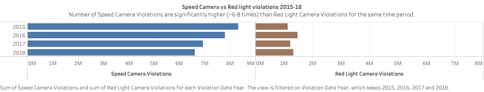

# Speed Camera Violations, City of Chicago 

This file documents the analysis of **_Speed Camera Violations_** dataset provided by the City of Chicago. 
The dataset can be accessed [here](https://data.cityofchicago.org/Transportation/Speed-Camera-Violations/hhkd-xvj4).

## Introduction
Chicago experiences roughly 3,000 crashes annually between motor vehicles and pedestrians, about 800 of which involve children. Hence, the city initiated Children’s Safety Zone Program which protects children and other pedestrians by reminding motorists to slow down and obey speed laws – especially in school and park zones. 
Safety zones are designated as a 1/8th of a mile boundary around any Chicago parks or schools.  
(Reference:https://www.chicago.gov/city/en/depts/cdot/supp_info/children_s_safetyzoneporgramautomaticspeedenforcement.html)

The program uses enhanced signage and automated safety cameras to identify and ticket motorists who are breaking the law by exceeding the speed limits. Automated speed enforcement cameras are one part of the “toolbox” the City uses to enhance safety for children and all residents in safety zones.   (Reference:https://www.chicago.gov/city/en/depts/cdot/supp_info/children_s_safetyzoneporgramautomaticspeedenforcement.html)

## Speed Camera Violations Dataset
According to [Chicago Data Portal](https://data.cityofchicago.org/Transportation/Speed-Camera-Violations/hhkd-xvj4) website, this dataset reflects the daily volume of violations that have occurred in Children's Safety Zones for each automated speed enforcement camera. The data reflects violations that occurred from July 2014 to April, 2019. The dataset contains all violations regardless of whether a citation was issued.

### Exploratory Data Analysis (EDA)

[**Link to my Tableau public URL**](https://public.tableau.com/views/SpeedCameraViolations_Chicago_2014-19/Story1?:embed=y&:display_count=yes) 

1. Exploratory data analysis of this dataset revealed that there is an overall decline in the total number of violations recorded from 2015 to 2018 (years for which complete data is available). 

2. There are certain locations/ zip codes which have very high number of recorded violations as compared to other locations.

3. When plotting the number of violations on the city's map, northen part of the city has more locations with higher number of violations then the south.

  

## Delving deeper into findings from EDA
In Part 2 of this analysis, a set of dashboards have been developed for the Mayor of Chicago, to reveal interesting findings from the Speed Camera Violations Dataset.

[**Link to my Tableau public URL**](https://public.tableau.com/shared/CMRF63GT4?:display_count=yes) 

After EDA, there were certain questions that I wanted to explore which  guided this phase of the analysis. These questions and the subsequent analysis are presented below.

 
 

### Q.1. Relationship between Red Light Camera Violations and Speed Camera Violations - __Are locations with Speed Camera violations also likely to have higher number of red light camera violations?__ 

Since Chicago also has a red light camera enforcement program, I wanted to compare the number of red light violations with speed camera violations to explore if there is any correlation between red light violations and speed camera violations- are certain areas in the city more prone to such violations and if yes what steps can be taken to make them safe.

The Red Light Camera violations dataset can be found [here](https://data.cityofchicago.org/Transportation/Red-Light-Camera-Violations/spqx-js37). 
I joined this dataset with Speed Camera dataset using **Violation Date** and **Zip Code** attributes and performing a full outer join since I did not want to lose any data from the Red Light Violations dataset (Losing out data might affect the overall numbers. Additionally this analysis can also be performed without joining the datasets and creating independent charts. I wanted the charts to appear in the same worksheet and hence performed the join.)

I first compared the number of speed camera violations with the number of red light camera violations from 2015 - 2018 and found that the number of red light violations are much smaller as compared to Speed Camera Violations.

Turns out that number of **Speed Camera Violations are 6-7 times higher than red-light violations**.The difference in magnitude is surprising!

Next, I was interested to see if the same Zip Codes that were notorious for high speed camera violations had higher red light violations as well. I plotted the average number of violations per zipcode and arranged them in descending order and filtered the top 10 zip codes with highest number of violations. I then plotted the correponding average number of red-light camera violations against those zipcodes. The chart can be seen below.

Here again, one can see that there is no direct correlation between the number of speed camera violations in a zip - code with the number of red-light camera violations.

**Implications**
- Based on these two findings, one possible explanation could be that red light enforcement is one of the oldest and universal traffic rules. That could explain why the number of violations are significantly smaller than Speed Camera Violations. Speed Camera enforcement is also present only in certain earmarked safety zones in the city and is enforced during certain hours of the day, which might be one of the causes of higher number of violations.

- Secondly, ticket values for Red Light violations are _$100_ whereas for Speed Camera violations tickets are _$35_ dollars for violations of 10 mph over the posted speed and _$100_ for violations of 11 mph and more. The slight irregularity and reduced ticket price could be one of the potential reasons for higher speed camera violations. (I could not find tickets dataset on the website to corroborate this insight. It would be interesting to see how many tickets are issued for less than 10 mph violations and how many are issues for violations of 11 mph and higher.)

**Action:** 
- Increasing awareness about Speed Camera Enforcement program, increased signage, advertisements and  campaigns can help reduce the number of speed-camera violations.
- The city can also consider increasing the ticket value for speed camera violations and see if that helps reduce the number of violations committed especially in zipcodes with the highest number of speed violations. 

This does however leave questions unanswered about why some zipcodes have highest number of violations. This can be explored further using demographics or traffic datasets. I plan to explore some datasets in the second phase of this analysis.

 
 
  
### Q.2. Number of Speed Enforcement Cameras and Speed Violations - Does the number of speed enforecement cameras help reduce the number of the violations?

Speed Camera Dataset lists more than one camera for an address or zipcode. I was interested to understand why did some Zip codes have more number of cameras than others. Also, how many cameras were in operation between 2015-18 and whether any changes in the number of cameras has an impact on the number of violations.

I first created a calculated field to count the distinct number of cameras. Tableau lets users create a calculated field by clicking on the field and selecting "Calculated Field" option from the drop-down menu. A formula can then be entered is the dialog box and Tableau lets users know if the formula is correct and can be applied.
I used the formula in the image below which is similar to COUNT (DISTINCT *) in MySQL. 

Next I plotted the number of speed enforcement cameras from 2015 - 2018 and the average number of violations committed for the same time period.

In the above chart one can see that the number of cameras have remained constant, but the average number of violations have declined. This means that the speed enforcement program has a general declining trend. However, it is not clear if that is due to number of cameras. It also not explain why the city decided to increase the number of installed cameras in 2018 when the number of violations continued to decline.

I tried to explore this further by first plotting the number of cameras and the number of zip codes using bar charts. To identify the cameras that were added in 2018, I created a group of such cameras, renamed the group as 'Cameras added after 2018' and used that as a color to identify the additions in the chart below.

In the chart, one can see that even though there are outliers, there is an overall decline in the average number of violations as the number of cameras increased. However, the difference by addition of new cameras is not quite evident.

I then created a scatter plot between the average number of speed violations committed and the number of speed enforcement cameras to see if there was any correlation that was missed in previous charts. I added Zipcodes for increased granularity. 

The chart above depicts that there is an overall decline in the number of violations as the number of cameras increases, however there is significant variation especially in Zipcodes with lower number of cameras. 

**Implications**
- Based on the above charts, one can see that number of Speed Violations committed have been declining consistently from 2015 to 2018 (years for which complete data is available), which is a positive sign. However, since the number of cameras installed has remained constant through majority of this period, it is not clear whether the program is witnessing success due to number of cameras installed or is it a general decline. 
- From the scatter plot it is appears that as the number of cameras increases, the average number of violations committed per zipcode decreases. However, there are outliers with high number of average violations which need to be studied further. 

**Action:**
- Zipcodes with high number of violations need to be studied to identify the reason for such high violations and if required, increased surveillance can be adopted as one of the methods to help reduce the number of violations.

I also plan to group Zipcodes with highest number of violations and study the trend of number of violations with respect to the number of cameras; and compare that with Zipcodes with lower number of violations and see if that can provide any interesting findings.

 
 

### Q.3. Comparing Speed  data with Traffic Crashes - Does Speed Camera enforcement lead to reduction in number of traffic crashes and resulting fatalities?

I wanted to understand the success of the speed enforcement program by studying the number of crashes in Speed Enforcement zones over the same time period. Chicago Data Portal's [website](https://data.cityofchicago.org/) provides two datasets: 
- [Traffic Crashes - Crashes](https://data.cityofchicago.org/Transportation/Traffic-Crashes-Crashes/85ca-t3if) : This dataset has information about each traffic crash on city streets within the City of Chicago limits and under the jurisdiction of Chicago Police Department (CPD) 
- [Traffic Crashes - People](https://data.cityofchicago.org/Transportation/Traffic-Crashes-People/u6pd-qa9d) : This dataset contains information about people involved in a crash and if any injuries were sustained.

I worked on these two datasests to understand the different attributes and performed data cleaning using Excel to get rid of unwanted columns. The original datasets had 48 columns ( Traffic Crashes) and 29 columns ( People dataset). 

 
My cleaned Traffic Crashes had 15 columns including RD_No (unique id for each records, helpful to join the traffic crashes with people involved in the crash), Crash Date, Speed Limit, Primary Contributory Cause (to identify speed and non- speed related crashes), Injuries, Crash hour and time, and location related columns.

 
The cleaned People dataset consisted of the following columns. I split the Crash Date column to separate time and date. I retained this field to be able to use this sheet independently if needed.

 
I tried to visualize traffic crashes and resulting fatalities on the map of Chicago and see whether there is any overlap with Speed Camera Violations. Below is a snapshot of my dashboard.

One can see that locations with speed camera enforcement tend to have less number of fatalities as compared to other locations. 

Unfortunately, the Traffic datasets can only be combined with Speed Camera violations dataset using Latitude and Longitude fields to map crashes that occured in Speed Camera Enforced locations. I plan to do that in the second phase of this analysis and be able to use attributes of the traffic crashes dataset to explore crashes due to speeding, crashes involving pedestrians and cyclists in these locations.

**Implications**
- Speed enforcement can lead to reduced fatalities during traffic accidents since speed is a big contributing factor in severity of an accident. The maps above indicate success of the program through reduced fatalities in speed enforcement locations.

**Actions:**
- Traffic Crashes dataset can be explored further to identify locations prone to accidents due to speeding and introduce speed camera enforcement to make them safer for public.

